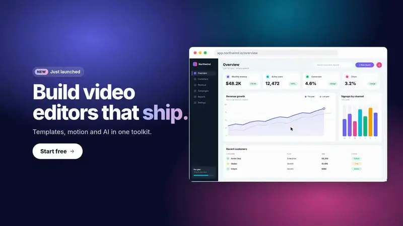

<h1 align="center">Miraiclip</h1>

<p align="center">
  <a href="https://www.npmjs.com/package/@miraiclip/core"></a>
  <a href="./LICENSE"></a>
  <a href="https://discord.gg/7S2XmHBeX"></a>
  
</p>

<p align="center"><b>Build video editors, not video editor plumbing.</b></p>

<p align="center">
  <a href="https://comaniacs.github.io/miraiclip/docs/quickstart/">Quickstart</a> ·
  <a href="https://comaniacs.github.io/miraiclip/examples/">Live examples</a> ·
  <a href="https://comaniacs.github.io/miraiclip/docs/">Docs</a> ·
  <a href="https://comaniacs.github.io/miraiclip/docs/roadmap/">Roadmap</a> ·
  <a href="https://discord.gg/7S2XmHBeX">Discord</a>
</p>

<p align="center">
  <a href="https://comaniacs.github.io/miraiclip/#demo">
    
  </a>
  <br>
  <sub>An editor built with Miraiclip, start to export. <a href="https://comaniacs.github.io/miraiclip/#demo">Watch the full 90-second demo with sound →</a></sub>
</p>

Miraiclip is an open source, framework-agnostic engine for video editors in the browser. You bring the UI; it brings the timeline, the commands, the renderer and the export.

## What you get

- **Commands, not mutations.** Every edit is a validated, serializable, undoable command.
- **Undo, redo, transactions.** Exact history out of the box.
- **Frame-accurate preview.** WebCodecs + WebGL, the same pixels as export.
- **Export anywhere.** MP4 or WebM in the browser, a worker, or Node.
- **Creative toolkit.** Keyframes, 79 effects, transitions, karaoke captions.
- **HTML clips.** Overlays in HTML/CSS with `{{params}}` and CSS animation, frame-exact.
- **Templates.** One composition → many personalized videos.
- **Audio.** Stock libraries and AI generation, with licenses and credits.
- **AI-native.** LLM tools from the command catalog, an editing assistant, an MCP server.
- **Collaboration-ready.** Every change is a JSON patch.
- **Headless core.** No UI dependencies. React, Vue, Svelte, vanilla, or Node.

## Quick start

```bash
npm install @miraiclip/core @miraiclip/renderer
```

```ts
import { createProject } from "@miraiclip/core";
import { exportProject } from "@miraiclip/renderer";

const project = createProject({ width: 1920, height: 1080, fps: 30 });

project.dispatch({ type: "asset/add", payload: { id: "intro", kind: "video", src: "/intro.mp4", durationUs: 12_000_000 } });
project.dispatch({ type: "track/add", payload: { id: "v1", kind: "video" } });
project.dispatch({
  type: "clip/add",
  payload: { kind: "video", id: "c1", trackId: "v1", assetId: "intro", startUs: 0, durationUs: 5_000_000 },
});

project.undo();
project.redo();

const mp4 = await exportProject(project, { format: "mp4", quality: "high" });
```

Times are in microseconds (1 s = 1,000,000 µs). Next: [playback on a canvas](https://comaniacs.github.io/miraiclip/docs/rendering/), [reading state](https://comaniacs.github.io/miraiclip/docs/core-concepts/project-state/), [the command catalog](https://comaniacs.github.io/miraiclip/docs/command-catalog/).

## Let an agent edit

```ts
import { toToolDefinitions, commandTypeForTool, tryDispatch } from "@miraiclip/core";

const tools = toToolDefinitions(project.commandCatalog()); // Anthropic or OpenAI shape

// For each tool call the model makes:
const type = commandTypeForTool(call.name, Object.keys(project.commandCatalog()));
const result = tryDispatch(project, { type: type!, payload: call.input }); // failures are machine-readable
```

Or plug Claude, Codex or any MCP client straight in, with frame previews it can see:

```sh
npx @miraiclip/mcp --project ./video.miraiclip.json --assets ./media
```

[AI integration](https://comaniacs.github.io/miraiclip/docs/ai-integration/) · [Assistant](https://comaniacs.github.io/miraiclip/docs/assistant/) · [MCP server](https://comaniacs.github.io/miraiclip/docs/mcp-server/)

## Packages

| Package | Version | What it does |
| --- | --- | --- |
| [`@miraiclip/core`](https://comaniacs.github.io/miraiclip/docs/core-concepts/) | 0.5.7 | State, commands, history, events, AI tools |
| [`@miraiclip/renderer`](https://comaniacs.github.io/miraiclip/docs/rendering/) | 0.7.11 | Playback, preview, stills and export |
| [`@miraiclip/server-export`](https://comaniacs.github.io/miraiclip/docs/export/server-side/) | 0.4.3 | The same export from Node, plus a CLI |
| [`@miraiclip/templates`](https://comaniacs.github.io/miraiclip/docs/templates/) | 0.1.3 | Parameterized videos and batch rendering |
| [`@miraiclip/audio-sources`](https://comaniacs.github.io/miraiclip/docs/audio-sources/) | 0.2.1 | Stock and AI-generated audio with licenses |
| [`@miraiclip/assistant`](https://comaniacs.github.io/miraiclip/docs/assistant/) | 0.1.1 | AI editing assistant, any model |
| [`@miraiclip/mcp`](https://comaniacs.github.io/miraiclip/docs/mcp-server/) | 0.1.3 | MCP server for agents |
| `@miraiclip/react` | planned | React hooks and selectors |

## Status

Pre-1.0: APIs can change between minor versions. See the [changelog](./CHANGELOG.md), the [roadmap](https://comaniacs.github.io/miraiclip/docs/roadmap/) and [PLAN.md](./PLAN.md).

## License

[MIT](./LICENSE)
